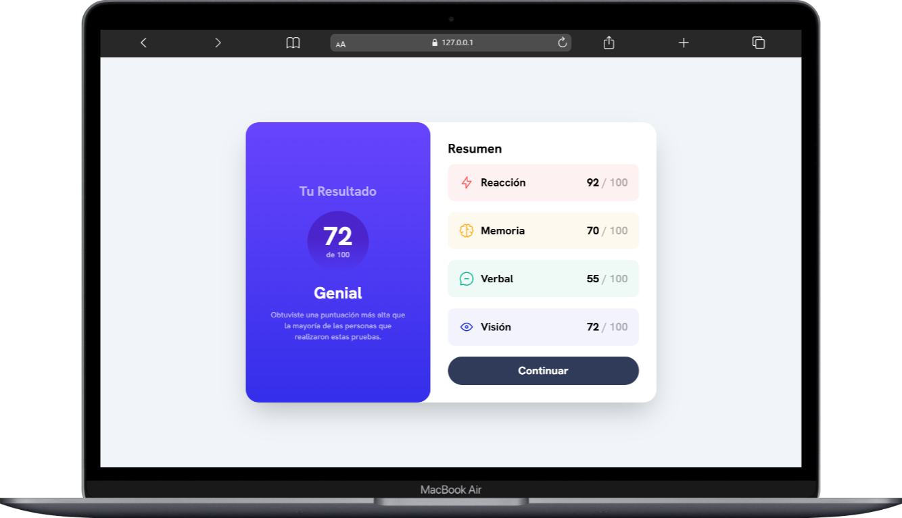
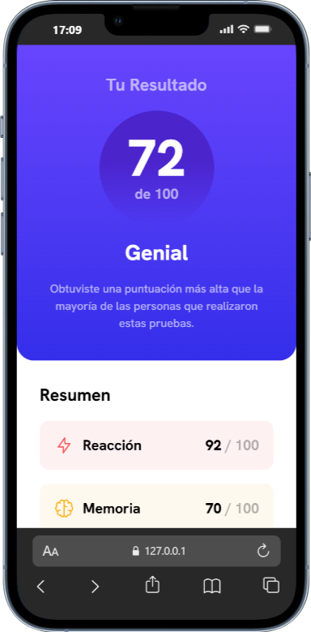

# 📊 Componente de Resumen de Resultados

Un componente web interactivo y responsive que muestra resultados de evaluación con diseño moderno, desarrollado con HTML, Tailwind CSS y JavaScript.

## 🎯 Descripción

Este proyecto es un componente de interfaz de usuario que presenta un resumen visual de resultados de pruebas de habilidades, incluyendo reacción, memoria, verbal y visual. El componente calcula automáticamente el promedio y adapta el mensaje según el rendimiento obtenido.

## 📸 Vistas Previas

### Vista Desktop


### Vista Mobile


## ✨ Características

- 📱 **Diseño Responsive**: Adaptado para dispositivos móviles y desktop
- 🎨 **Estilos Modernos**: Implementado con Tailwind CSS
- 📊 **Cálculo Dinámico**: Promedio automático de resultados desde JSON
- 💬 **Mensajes Personalizados**: Feedback adaptado según el puntaje obtenido
- ♿ **Accesibilidad**: Estructura semántica y atributos ARIA

## 🛠️ Tecnologías Utilizadas

- HTML5
- CSS3 (Tailwind CSS)
- JavaScript (ES6+)
- JSON para datos

## 🚀 Instalación y Configuración

### 1️⃣ Clonar el repositorio

### 2️⃣ Instalar dependencias
```bash
npm install
```

### 3️⃣ Compilar Tailwind CSS

**Modo desarrollo (watch):**
```bash
npx @tailwindcss/cli -i ./src/input.css -o ./src/output.css --watch
```

**Compilación única:**
```bash
npx @tailwindcss/cli -i ./src/input.css -o ./src/output.css
```

### 4️⃣ Abrir el proyecto

Abre `index.html` en tu navegador o utiliza un servidor local como Live Server.


## 👨‍💻 Desarrollado por

Este proyecto fue desarrollado como práctica de diseño responsive y componentes interactivos, demostrando habilidades en:
- Maquetación responsive
- Manipulación del DOM
- Fetch API
- Tailwind CSS
- Diseño de interfaces modernas

---
